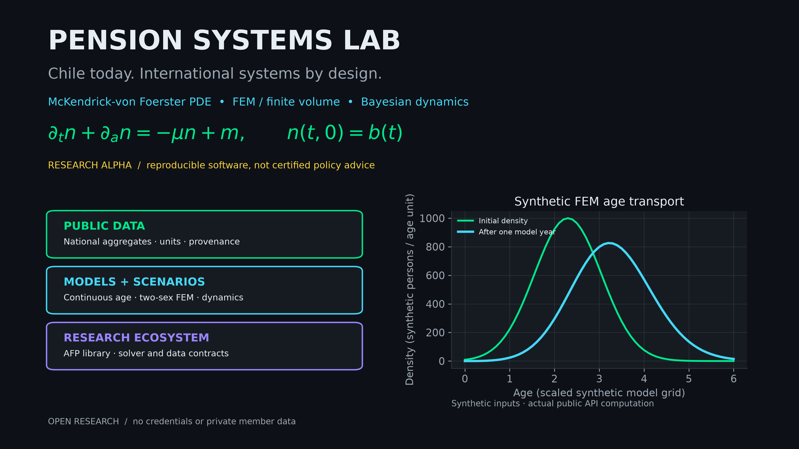

# Pension Systems Lab



**Alpha research workbench** for Chilean demographic and pension-system modelling: public-data validation, continuous-age transport prototypes, and JSON CLI smoke runs. It is not an official projection, actuarial certification, legal advice, or a current-law rule engine.

**Public project:** [Pension Systems — PDE & Bayesian Research](https://github.com/users/googa27/projects/36).

Companion package: [`afp-operations`](https://github.com/googa27/afp-operations). Public home: <https://github.com/googa27/pension-systems-lab>.

## What is implemented now

| Capability | Status | Notes |
|---|---:|---|
| Importable package `chile_demographic_pde` | Implemented | Verified locally with `uv run python -c 'import chile_demographic_pde'`. |
| CLI `pension-lab capabilities` | Implemented | Emits machine-readable scope and data policy. |
| CLI `pension-lab verify-data` | Implemented | Checks bundled curated public CSV totals and SHA-256 manifests. |
| CLI `pension-lab demo` | Implemented | Tiny deterministic two-sex FEM smoke scenario. |
| CLI `pension-lab pension-demo` | Implemented boundary | Optional public `afp_operations` dependency; returns a graceful unavailable status when absent. |
| Numeric verification | Implemented in tests | Default test suite includes 1,390+ passing tests, architecture checks, notebook/report tests, and MCMC/JAX CPU gates. |
| International data ingestion | Roadmap | Registry targets only; no international datasets are bundled here. |
| Official legal/current-law engine | Not a goal | Regulations are documented as dated source context only. |

## Quickstart

The package is **not published on PyPI**. Clone and run with `uv`:

```bash
git clone https://github.com/googa27/pension-systems-lab.git
cd pension-systems-lab
uv sync --all-extras --dev
uv run pension-lab capabilities
uv run pension-lab verify-data
uv run pension-lab demo
```

## Verification commands

```bash
JAX_PLATFORM_NAME=cpu XLA_FLAGS=--xla_force_host_platform_device_count=1 uv run pytest
uv run ruff check .
uv run ruff format --check .
uv run mypy
uv build
uv run python scripts/publication_guard.py --mode git
python scripts/scan_publication.py
```

The `JAX_PLATFORM_NAME`/`XLA_FLAGS` pins the default suite to CPU so optional NumPyro/MCMC smoke tests do not try to allocate accelerators in CI.

## Data, licensing, and private boundary

- Bundled inputs are curated public CSV fixtures with checksums; raw `.xlsx`/`.pdf` workbooks are intentionally not redistributed.
- Source pages, licenses, vintages, units, and coverage must be reviewed before adding any dataset.
- This public repository must not contain credentials, portal exports, raw private statements, internal paths, agent histories, or private integration details.
- The publication guard is intentionally fail-closed and refuses to infer scope from a parent Git checkout.

## Documentation

- [Research notes](docs/RESEARCH.md)
- [Chile regulation context](docs/REGULATION.md)
- [Ecosystem boundary](docs/ECOSYSTEM.md)
- [Architecture source of truth](docs/ARCHITECTURE.yaml)
- [Roadmap](docs/ROADMAP.md)

## License

Code: MIT. See [LICENSE](LICENSE). Bundled aggregate facts retain their original source terms; redistribution/licensing and retrieval metadata are explicitly unverified in [the public manifest](data/PUBLIC_MANIFEST.json), not relicensed as MIT.
